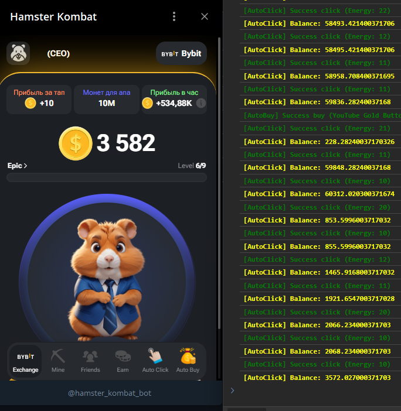

<br>

<div align="center">

[](https://t.me/hamster_kombat_bot)

  <h1 align="center">Auto Click for Hamster Kombat</h1>
  
  <p align="center">
    <strong>Bot for automatic clicking in the Telegram game Hamster Kombat.</strong>
  </p>
  

</div>

## Features
- Auto-click
- Auto-activate "Full Energy" booster
- Auto-buy the most cost-effective cards

## Enable Debug Mode for Mini Apps

### Android
- **[Enable USB-Debugging](https://developer.chrome.com/docs/devtools/remote-debugging/)** on your device.
- In Telegram Settings, scroll all the way down, press and hold on the version number two times.
- Choose Enable WebView Debug in the Debug Settings.
- Connect your phone to your computer and open chrome://inspect/#devices in Chrome – you will see your Mini App there when you launch it on your phone.

### Telegram Desktop on Windows and Linux
- Download and launch the **[Beta Version](https://desktop.telegram.org/changelog#beta-version)** of Telegram Desktop on Windows or Linux (not supported on Telegram Desktop for macOS yet).
- Go to Settings > Advanced > Experimental settings > Enable webview inspection.
- Right click in the WebView and choose Inspect.

### Telegram macOS
- Download and launch the **[Beta Version](https://telegram.org/dl/macos/beta)** of Telegram macOS.
- Quickly click 5 times on the Settings icon to open the debug menu and enable “Debug Mini Apps”.

## Launch script

Follow the steps below to launch script:

1. Open the game in Telegram Web App and the web inspector of your browser. You can do this by right-clicking on the page and selecting **"Inspect"** or **"Inspect Element"** (depending on the browser).

2. Switch to the **"Console"** tab. In the console at the bottom of the page, enter the copied script and press the **Enter** key.

```
const initParams = JSON.parse(sessionStorage.getItem('__telegram__initParams'))
initParams.tgWebAppPlatform = 'ios'
sessionStorage.setItem('__telegram__initParams', JSON.stringify(initParams))
window.location.reload()
```

3. After reloading the page, paste the following script into the console and press **Enter** key.

```
const originalConsoleLog = console.log;

console.log = function () {
  if (arguments[0].includes('[Auto') || arguments[0].includes('github.com')) {
    originalConsoleLog.apply(console, arguments);
  }
};

console.error = console.warn = console.info = console.debug = function () { };

const consoleStyles = {
  yellow: 'font-weight: bold; color: yellow;',
  red: 'font-weight: bold; color: red;',
  green: 'font-weight: bold; color: green;',
};

const consolePrefix = '%c [AutoBot] ';
const consolePrefixClicker = '%c [AutoClick] ';
const consolePrefixBuyer = '%c [AutoBuy] ';

console.log(`${consolePrefix}Injecting...`, consoleStyles.green);

let autoClickActive = false;
let autoBuyActive = false;
let autoClickInterval;
let clicksCount = 0;
let clickBtn;
let buyBtn;

async function updateClickerData() {
  const clickerStore = window.useNuxtApp().$pinia._s.get('clicker');
  const boostStore = window.useNuxtApp().$pinia._s.get('boost');
  const balance = clickerStore.balanceCoins;
  const availableTaps = clickerStore.availableTaps;
  const fullEnergySecondsCountdown = boostStore.fullEnergySecondsCountdown;
  return { balance, availableTaps, fullEnergySecondsCountdown };
}

async function click() {
  try {
    const { balance, availableTaps, fullEnergySecondsCountdown } = await updateClickerData();
    if (availableTaps >= window.useNuxtApp().$pinia._s.get('clicker').earnPerTap) {
        if (clicksCount > 0 && clicksCount % 10 === 0) await new Promise(resolve => setTimeout(resolve, 4000));
        await window.useNuxtApp().$pinia._s.get('clicker').earn();
        clicksCount++;
    
        console.log(`${consolePrefixClicker}Success click (Energy: ${availableTaps})`, consoleStyles.green);
        console.log(`${consolePrefixClicker}Balance: ${balance}`, consoleStyles.yellow);
    
        if (window.useNuxtApp().$pinia._s.get('boost').boostsForBuy[2]){
          if (availableTaps <= window.useNuxtApp().$pinia._s.get('clicker').earnPerTap + 10 && fullEnergySecondsCountdown === 0) {
            await window.useNuxtApp().$pinia._s.get('boost').postBuyBoost("BoostFullAvailableTaps");
            window.useNuxtApp().$pinia._s.get('boost').fullEnergySecondsCountdown = 3600
            console.log(`${consolePrefixClicker}Success take "Full Energy" booster`, consoleStyles.green);
          }
        }
    }
    if (autoClickActive) setTimeout(click, Math.random() * (137.7 - 151.2) + 151.2);
  } catch (e) {
    autoClickActive = false;
    console.log(`${consolePrefixClicker}Deactivated (Clicks: ${clicksCount})`, consoleStyles.red);
    updateButtonState(clickBtn, false);
    clearTimeout(autoClickInterval);
  }
}

async function autoBuy() {
  try {
    const { balance } = await updateClickerData();
    const upgradesForBuy = window.useNuxtApp().$pinia._s.get('upgrade').upgradesForBuy;

    const sortedData = upgradesForBuy
      .filter(item => item.isAvailable && !item.cooldownSeconds && !item.isExpired && balance >= item.price)
      .sort((a, b) => (a.price / a.profitPerHourDelta) - (b.price / b.profitPerHourDelta));

    if (sortedData.length > 0) {
      const bestCard = sortedData[0];
      if (balance >= bestCard.price) {
        try {
          await window.useNuxtApp().$pinia._s.get('upgrade').postBuyUpgrade(bestCard.id);
          console.log(`${consolePrefixBuyer}Success buy (${bestCard.name})`, consoleStyles.green);
        } catch (e) { }
      }
    }

    if (autoBuyActive) setTimeout(autoBuy, Math.random() * (3347.7 - 3451.2) + 3451.2);
  } catch (e) {
    autoBuyActive = false;
    console.log(`${consolePrefixBuyer}Deactivated`, consoleStyles.red);
    updateButtonState(buyBtn, false);
    clearTimeout(autoClickInterval);
  }
}

function updateButtonState(button, isActive) {
  const img = button.querySelector('img');
  img.style.filter = isActive ? 'none' : 'grayscale(100%)';
}

async function addLinkToNav() {
  const navElement = document.querySelector('.app-bar-nav');
  if (!navElement) {
    setTimeout(addLinkToNav, 1000);
    return;
  }

  clickBtn = createButton('Auto Click', '/images/boost-multitap.png', toggleAutoClick);
  navElement.appendChild(clickBtn);

  buyBtn = createButton('Auto Buy', 'https://i.imgur.com/30uwMSe.png', toggleAutoBuy);
  navElement.appendChild(buyBtn);

  document.querySelector('#__nuxt > div > div.app-bar > nav > a:nth-child(5)').remove();

  console.log(`${consolePrefix}Script loaded`, consoleStyles.green);
  console.log(`${consolePrefix}Code by @clqkx`, consoleStyles.green);
}

function createButton(text, imageSrc, clickHandler) {
  const button = document.createElement('a');
  button.href = '#';
  button.className = 'app-bar-item no-select';

  button.innerHTML = `
    <div class="app-bar-item-image">
      
    </div>
    <p>${text}</p>
  `;

  button.addEventListener('click', (event) => {
    event.preventDefault();
    clickHandler();
  });

  return button;
}


let firstToggleClick = true;
function toggleAutoClick() {
  autoClickActive = !autoClickActive;
  console.log(`${consolePrefixClicker}${autoClickActive ? 'Activated' : 'Deactivated'}`, autoClickActive ? consoleStyles.green : consoleStyles.red);
  updateButtonState(clickBtn, autoClickActive);
  if (firstToggleClick){
      document.querySelector('#__nuxt > div > main > div > div.user-tap.has-gap > div.user-tap-row > a').click()
      //document.querySelector('#__nuxt > div > div.app-bar > nav > a:nth-child(1)').click()
      firstToggleClick = false
  }
  if (autoClickActive) click();
}

function toggleAutoBuy() {
  autoBuyActive = !autoBuyActive;
  console.log(`${consolePrefixBuyer}${autoBuyActive ? 'Activated' : 'Deactivated'}`, autoBuyActive ? consoleStyles.green : consoleStyles.red);
  updateButtonState(buyBtn, autoBuyActive);
  if (autoBuyActive) autoBuy();
}

await addLinkToNav();
```

### That's it! Now you can use this script for automatic clicking in the Hamster Kombat game on Telegram.

## Author

Telegram: [@clqkx](https://t.me/clqkx)
Telegram Channel: [@clqkxdev](https://t.me/clqkxdev)
